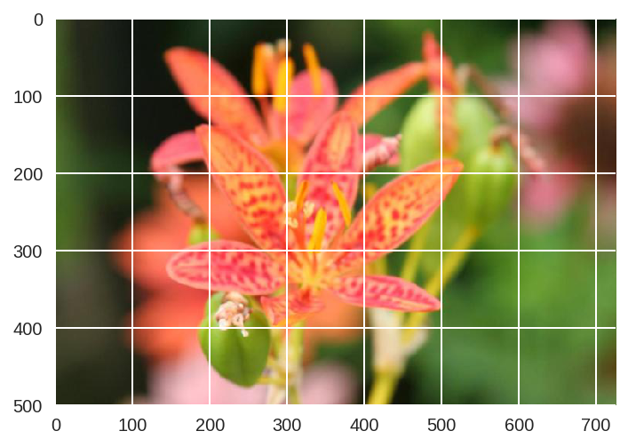

# image_classifier_pytorch

This is the repo for the FreeCodeCamp article *How to build an image classifier with greater than 97% accuracy* [The article can be found here](https://medium.freecodecamp.org/how-to-build-the-best-image-classifier-3c72010b3d55)  

*The image classifier was built as the final project for the Facebook AI PyTorch Challenge.*

**From the article:**

*How do you teach a computer to look at an image and correctly identify it as a flower? How do you teach a computer to see an image of a flower and then tell you exactly what species of flower it is when even you don’t know what species it is?*

*Let me show you!*

*This article will take you through the basics of creating an image classifier with PyTorch. You can imagine using something like this in a phone app that tells you the name of the flower your camera is looking at. You could, if you wanted, train this classifier and then export it for use in an application of your own.*

**What you do from here depends entirely on you and your imagination.**

*I put this article together for anyone out there who’s brand new to all of this and looking for a place to begin. It’s up to you to take this information, improve on it, and make it your own!*

 [Read the rest of the article here](https://medium.freecodecamp.org/how-to-build-the-best-image-classifier-3c72010b3d55)
 
 *****

**From the Deep Learning Nanodegree Image Classifier project specifications through Udacity (edits have been made for clarity):**

"Going forward, AI algorithms will be incorporated into more and more everyday applications. For example, you might want to include an image classifier in a smart phone app. To do this, you'd use a deep learning model trained on hundreds of thousands of images as part of the overall application architecture. A large part of software development in the future will be using these types of models as common parts of applications.

In this project, you'll train an image classifier to recognize different species of flowers. You can imagine using something like this in a phone app that tells you the name of the flower your camera is looking at. In practice you'd train this classifier, then export it for use in your application. We'll be using this dataset of 102 flower categories, you can see a few examples below.

The project is broken down into multiple steps:

* Load and preprocess the image dataset
* Train the image classifier on your dataset
* Use the trained classifier to predict image content

This is an application that can be trained on any set of labeled images. Here your network will be learning about flowers and end up as a command line application. What you do with your new skills depends on your imagination and effort in building a dataset. For example, imagine an app where you take a picture of a car, it tells you what the make and model is, then looks up information about it. Go build your own dataset and make something new."
